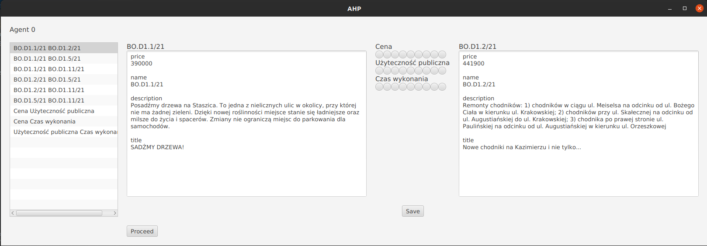
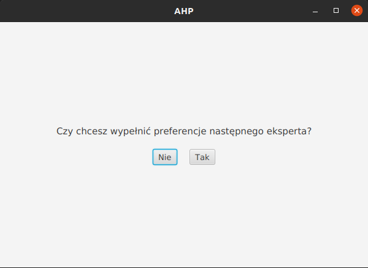
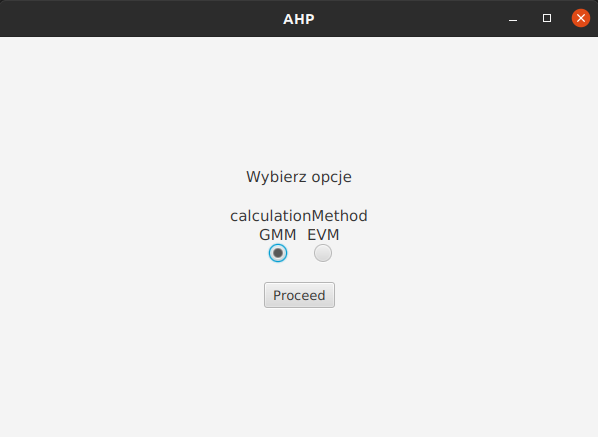
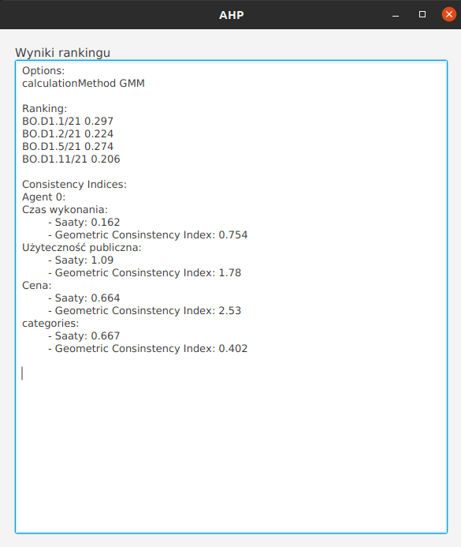

# Rating application based on the idea of AHP
Project implemented during classes on 3rd year at AGH UST. Application is designed to enhance decision-making process. The idea is that experts rate few alternatives under given criterias. For example experts are city councilors, alternatives are civil projects and cirterias are cost, public utility etc. 
Rating process is based on comparing pairs of alternatives. Each expert should fill his preferences for each pair. Compared are not only alternatives, but categories as well. For example for one expert cost may be more important than public utility.
 
Once expert has finished rating, application asks for next expert preferences.
 
When all preferences are collected, user can select calculation method.
 
At the end, a ranking is calculated, and printed out with some additional information.
 
